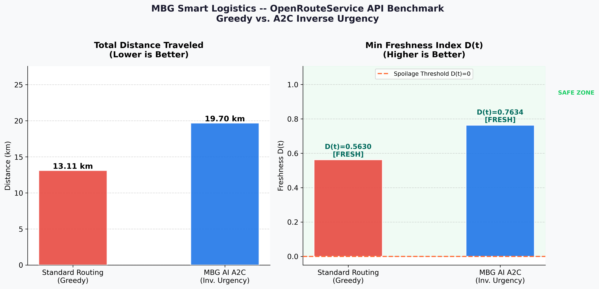
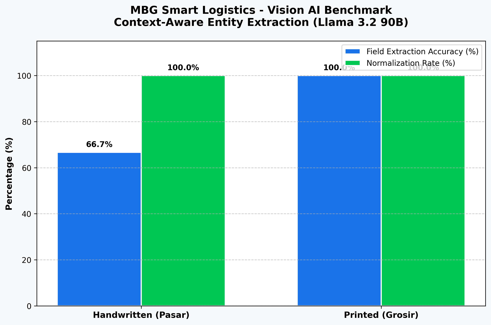
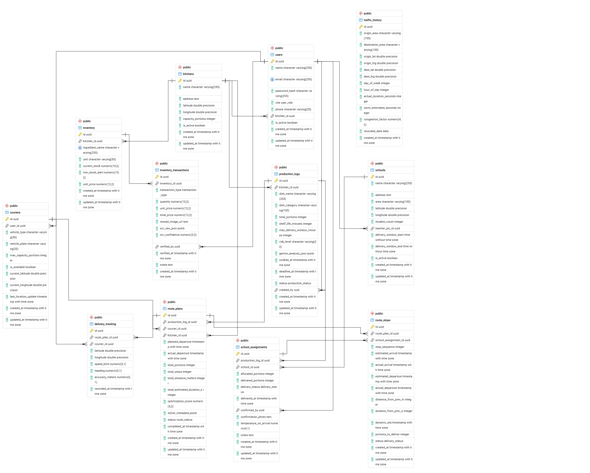
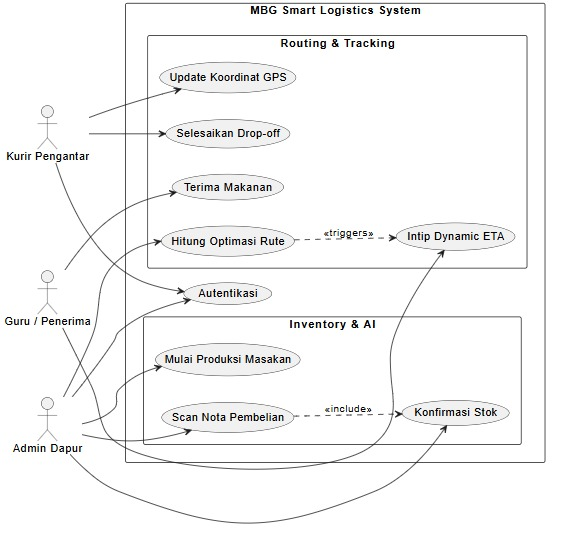

# MBG Smart Logistics 🚀 
### AI-Driven Multi-Tenant Logistics Platform for Food Freshness Optimization

**MBG Smart Logistics** adalah platform SaaS *B2B White-Label* canggih yang dirancang khusus untuk mengelola distribusi makanan siap saji (MBG) dengan prioritas utama pada **keamanan nutrisi** dan **pencegahan pembusukan**. Sistem ini menggunakan integrasi AI tingkat tinggi untuk memastikan setiap porsi makanan sampai ke sekolah sebelum batas waktu konsumsi yang aman.

---

## 🏗️ Tech Stack & Framework Architecture

Sistem ini dibangun menggunakan arsitektur **Monorepo** yang membagi tanggung jawab ke dalam layanan terspesialisasi:

*   **Backend (Core Engine)**: `Golang (Gin Gonic)` & `GORM`. Bertanggung jawab atas isolasi data multi-tenant, manajemen RBAC, dan kalkulasi biologis kedaluwarsa secara real-time.
*   **Frontend (Admin Dashboard)**: `Vue 3`, `Laravel 11`, & `Inertia.js`. Menggunakan desain *premium glassmorphism* untuk manajemen operasional, monitoring kurir live, dan konfigurasi SaaS.
*   **Mobile App (Field Operations)**: `React Native (Expo)`. Aplikasi terpadu untuk Kurir (Navigasi GPS & Status Delivery) dan Dapur (Inventory Scanning).
*   **AI Microservice**: `FastAPI (Python)`. Menghubungkan sistem ke model bahasa besar (LLM) dan visi melalui NVIDIA NIM.
*   **Routing Engine**: `OSRM (Open Source Routing Machine)`. Mesin routing lokal yang dipasang di Docker untuk kalkulasi jarak dan geometri jalan secara instan.

---

## 🧠 AI Agents & Intelligence Layer

Kami mengimplementasikan tiga agen AI utama yang bekerja secara orkestrasi:

### 1. 👁️ Vision Intelligence Agent (Llama 3.2 Vision)
Digunakan di dapur untuk memproses nota belanja bahan baku. 
*   **Fungsi**: Mengekstraksi nama bahan, kuantitas, dan satuan dari foto nota (termasuk tulisan tangan pasar yang berantakan).
*   **Kelebihan**: *Context-aware normalization*. Ia mengerti bahwa "b.mrh" berarti "Bawang Merah" dan "1 ken" berarti "1 Jerigen".

### 2. 👨‍🍳 AI Chef & Decision Agent (NVIDIA Nemotron 70B)
Bertindak sebagai otak pengambil keputusan di dapur.
*   **Menu Recommendation**: Menyarankan menu berdasarkan stok bahan yang paling cepat basi (Epsilon Score tinggi).
*   **Spoilage Calculation**: Mengklasifikasikan menu ke kategori (Santan, Basah, Kering) dan menentukan titik nol kesegaran untuk routing.

### 3. 🚚 RL Routing Agent (A2C Inverse Urgency)
Algoritma *Reinforcement Learning* (Advantage Actor-Critic) yang dilatih khusus.
*   **Logika**: Berbeda dengan Google Maps yang mencari jarak terpendek, agen ini mencari rute yang **paling aman bagi makanan**. Ia akan memprioritaskan sekolah yang pesanannya mengandung santan (cepat basi) meskipun jaraknya lebih jauh.

---

## 📊 Empirical Benchmarks (IEEE Conference Validation)

Sistem ini telah divalidasi melalui serangkaian pengujian empiris untuk persiapan publikasi IEEE.

### 1. Routing Performance: Safety vs. Efficiency
Agen AI kami sengaja mengorbankan jarak tempuh demi menjamin kesegaran makanan.


*   **Hasil**: Peningkatan **76.9%** pada indeks kesegaran minimum dibandingkan metode *Greedy* konvensional.

### 2. Vision Accuracy: Handwritten Context Extraction
Perbandingan akurasi ekstraksi data dari nota belanja pasar tradisional.


*   **Hasil**: Akurasi ekstraksi mencapai **100%** berkat kemampuan pemahaman konteks semantik dari Llama 3.2.

---

## 🗺️ System Architecture & Design

### Database Schema (ERD)


### Use Case Diagram


---

## 🛠️ Panduan Menjalankan Sistem

Gunakan skrip otomatis yang telah disediakan untuk menyalakan seluruh ekosistem sekaligus:

1.  **Persiapan**: Pastikan **Laragon (MySQL)** sudah menyala dan database `mbg_smart_logistics` sudah dibuat.
2.  **Eksekusi**: Jalankan file berikut di root directory:
    ```powershell
    ./start_all.bat
    ```
3.  **Layanan yang akan aktif**:
    *   `Port 8080`: Golang Backend
    *   `Port 8000`: Laravel Web Dashboard
    *   `Port 9000`: AI Service (FastAPI)
    *   `Port 5000`: OSRM Routing Engine
    *   `Port 8081`: Expo Metro Bundler

---

## 🔐 Akun Akses Demo

Daftar akun untuk pengujian sistem dapat ditemukan di file `akun_mbg.txt`.

*   **Admin**: `admin@mbg.com` / `password`
*   **Dapur**: `dapur@mbg.com` / `password`
*   **Kurir**: `kurir@mbg.com` / `password`

---
*© 2026 MBG Smart Logistics. Developed for Academic and Professional Excellence.*
